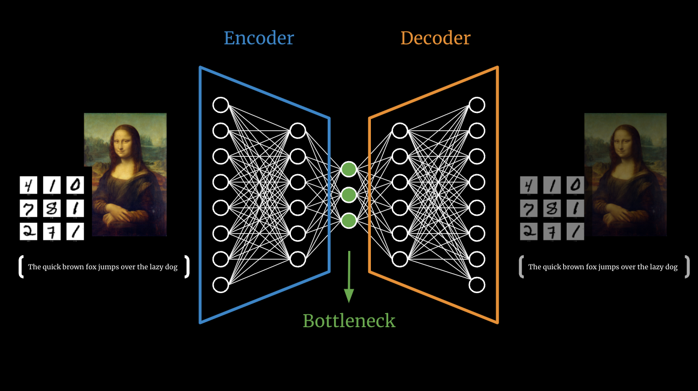
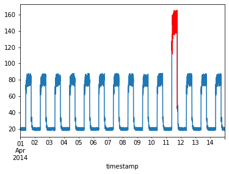
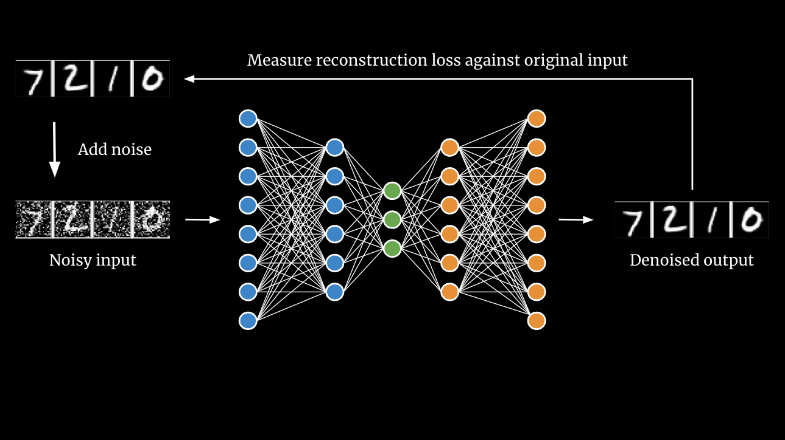
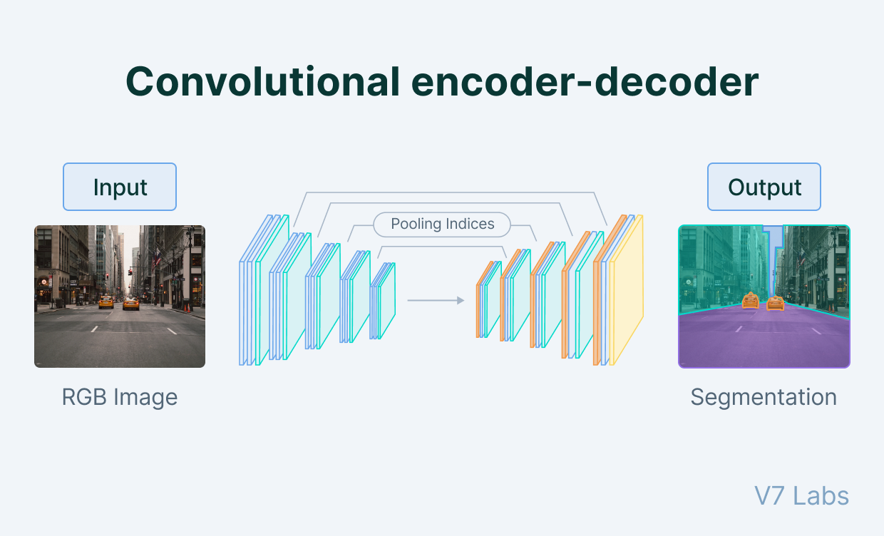
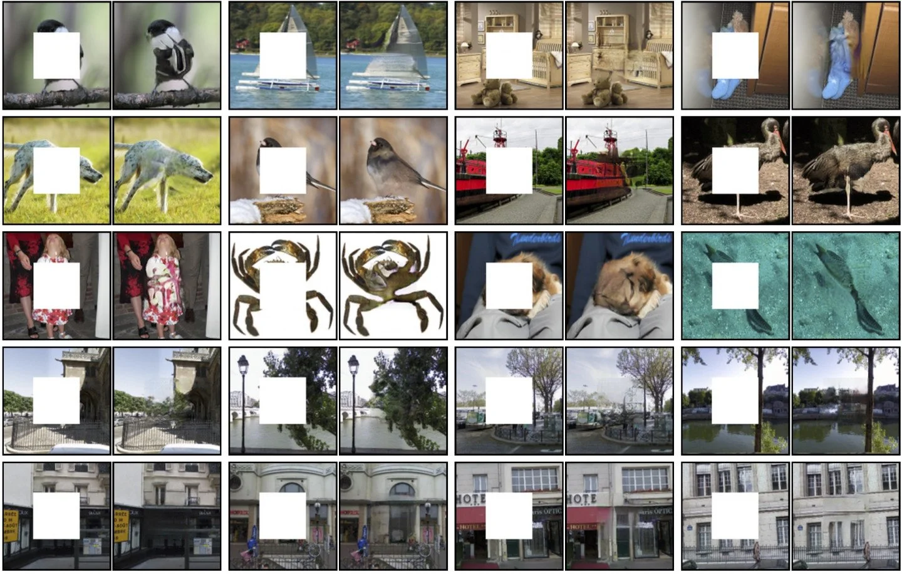

# Why Autoencoders are so Effective?
With the recent advances in the Artificial intelligence and machine learning field, we now have access to a wide range of technologies that enable computer systems to tackle a variety of data problems efficiently. Autoencoders are an unsupervised learning technique in which we leverage neural networks to learn features of our input data implicitly.

Whether you want to perform dimensionality reduction, denoise images to reconstruct the original images, or detect anomalies in time series problems, or even perform complex analysis such as image segmentation, an autoencoder model can be a solution. In this blog post, you will get familiar with the fundamentals of autoencoder models and learn about their several use cases in real life problems. If you are interested in the video explanation of this topic, make sure to watch the following Youtube video where I briefly talk about autoencoders and their application:



## What is an autoencoder?

An autoencoder is a type of artificial neural network that takes some kind of input data which can be images, vectors, audio or whatever, and it first compresses the original input data into a lower dimension and then uses this lower dimensional representation of the data to recreate the original input!

The question is why should we care about reconstructing the same input? Infact, we don’t care about the output but rather we care about compressed lower dimensional representation of the input data. By training the data to minimize the error between the original data and its reconstructed version, the model utilizes the neural network to find the most efficient representation of the input data which contains the most important features. And those features will be summarized in the latent space (see Figure 1).

*Figure 1. Encoder, bottleneck, and decoder stages working together to learn compressed representations.*

## Autoencoder model architecture
An autoencoder consists of three major components as illustrated above:

1) An encoder which is a module that compresses the input data into an encoded representation that is several times smaller than the input data
2) The Bottleneck or Code which contains the compressed representations 
3) And the decoder module that decompresses the bottleneck representation and tries to reconstruct the data back from its encoded form.

The reason we are setting the size of the bottleneck smaller than the rest of the layers is that it forces the information loss and therefore the encoder and decoder needs to work together to find the most efficient compressed form of the input data. The latent feature vector space needs to be small and the encoder and decoder part should be shallow. Otherwise, the resulting latent representation becomes useless as it simply copies the input to output.

In the following section, I will look into several applications of autoencoders and provide you with some examples.

## Applications of autoencoder models

### Anomaly detection
Anomaly detection is a perfect example, where we train the model on normal instances so that if we feed it any outliers, they will be detected easily. In this case, we can use the reconstruction loss as a metric to detect outliers, as shown in Figure 2.

*Figure 2. Spikes in reconstruction error separate abnormal signals from nominal operation.*

### Image denoising
We already talked about the concept of training autoencoders where the input and outputs are identical and the task is to reproduce the input as closely as possible. However, one way to develop a generalizable model is to slightly augment the input data but still keep the original input as our target output.

Imagine that you start with a normal MNIST digit and add noise to them and run that noisy image through the autoencoder model. The only difference is that instead of reconstructing the noisy images, you try and reconstruct the original images. By training our autoencoder model this way, we force the model to get rid of the noise and eventually our model becomes really good at denoising images. That is how denoising autoencoders are used (Figure 3).

*Figure 3. Noisy inputs (left) are restored to clean digits (right) after passing through the autoencoder.*

### Image segmentation
Image segmentation is another example where autoencoders are used to take image inputs preserving spatial representation and aim to output semantic segmented counterparts of the image. This technique is used in self-driving cars to segment different objects in their environment, depicted in Figure 4.

*Figure 4. Latent features guide the decoder to produce per-pixel semantic masks.*

### Neural inpainting
Lastly, I am going to talk about neural inpainting approaches where instead of adding noise to our inputs, you basically block parts of the image and force the AI model to reconstruct the missing parts. This approach simply powers many apps we use these days including Magic Eraser on the Pixel phones which uses similar machine learning concepts (Figure 5).

*Figure 5. Missing regions are reconstructed using contextual cues captured in the latent code.*

Hope you enjoyed reading this and learned a little bit about autoencoder models. Make sure to sign up for my newsletter, The Attention, where I talk about recent advances in the AI x BIO space and also document my work life as a Computational Scientist.
