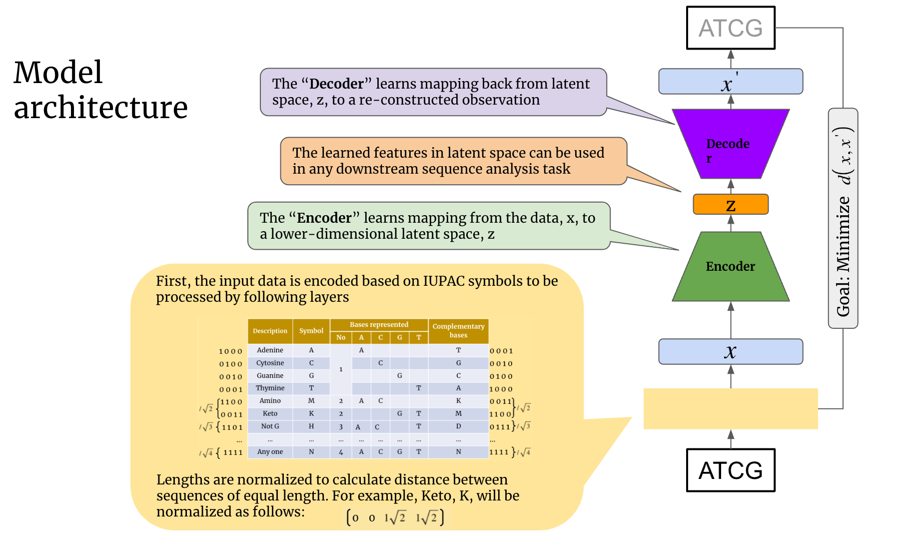

# ntEmbd: Deep learning embedding for nucleotide sequences

Enabled by the explosion of data and substantial increase in computational power, deep learning is finding increasingly more applications in genomics research. Deep learning abstracts features from input data typically through an autoencoding process, embedding symbolic representations of sequences into vectors of floating point numbers. These latent representations can then be used in downstream tasks, such as data classification and clustering. In genomics applications, models based on embedding methods heavily use paradigms established in the natural language processing (NLP) domain. However, analysis of nucleotide sequences presents particular challenges, limiting the utility of NLP paradigms; these include wider distribution of sequence lengths (e.g. transcript sequence lengths) and long-range dependencies between features (e.g. cis- and trans-regulatory motifs). These challenges may be addressed by an embedding model specifically designed for nucleotide sequences.

Here, we introduce ntEmbd, a nucleotide sequence embedding method for latent representation of input nucleotide sequences. The model is built on a Bi-LSTM autoencoder architecture to summarize data in a fixed-dimensional latent representation, capturing both local and long-range dependencies between features. To illustrate its utility, we trained ntEmbd with full-length human transcript sequences from GENCODE Release 36. We split the dataset into training (80%) and test (20%) sets. We used part of the train set as a validation set to implement an early stopping approach monitoring the training process to avoid overfitting and to allow for the generalization of the model.

To illustrate the performance of ntEmbd, we applied it on a functional annotation task, assessing the coding potential of RNA transcripts, classifying them as coding and noncoding transcripts. For this task, we labeled RNA transcripts as protein-coding and not protein-coding based on biotype classes provided by the GENCODE project. Next, ntEmbd representations of these sequences along with their labels are used as input to train a downstream supervised classifier to distinguish coding and noncoding transcripts. We compared the performance of our model with five state-of-the-art coding potential predictors. In our tests with the mRNN-challenge dataset, our classifier built on ntEmbd was able to outperform the other predictors with an accuracy score of 0.884. RNASamba, mRNN, CPAT, CPC2, and FEELnc scored 0.834, 0.869, 0.730, 0.693, and 0.782 respectively. We expect the ntEmbd paradigm to be general enough to facilitate other sequence classification and clustering tasks when its embedding model is fine-tuned to the problem domain.

ntEmbd is freely available at: https://github.com/bcgsc/ntembd

